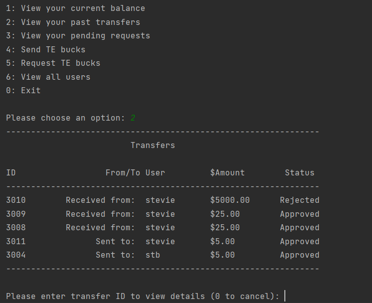

# TEnmo - A Money Transfer Application

TEnmo is an online payment service for transferring "TE Bucks" between friends. Users can send, request, and approve money transfers, as well as view their transfer history and outstanding balance. A command-line front end allows users to dictate their actions to the RESTful API server in the back end.

## Installation

1. To initialize the database, create a new Postgres database titled `tenmo` and run the `database/tenmo.sql` script.
2. Run tenmo-server/.../TenmoApplication.java to get the server up and running, after which you may:
3. Run tenmo-client/.../App.java to begin the command-line interface.

## Usage

1. A user may register and log in with a unique username and password.
   1. A new registered user starts with an initial balance of 1,000 TE Bucks.
2. A user can view their account balance.
3. A user can send a transfer of a specified amount of TE Bucks to another registered user.
   1. A list of registered users excluding the present user will be displayed to select from.
   2. A user cannot send more than they have in their account balance.
   3. The amount sent must be a positive, non-zero value.
   4. Sent transfers are automatically approved and will go through immediately.
4. A user can see transfers they have sent or received.
5. A user  can retrieve the details from any of their transfers based upon the transfer ID.
6. A user may request a transfer of a specified amount of TE Bucks from another registered user.
   1. A list of registered users excluding the present user will be displayed to select from.
   2. The amount requested must be a positive, non-zero value.
   3. A request transfer will remain as pending until approved or denied by the request receiver.
   4. No account balance changes until the request is approved.
7. A user may see the list of their pending transfers.
8. A user can either approve or reject a request transfer.
   1. A request cannot be approved for more TE Bucks than the user has in their balance.

----

## Database schema

### `tenmo_user` table

Stores the login information for users of the system.

| Field           | Description                                                                    |
| --------------- | ------------------------------------------------------------------------------ |
| `user_id`       | Unique identifier of the user                                                  |
| `username`      | String that identifies the name of the user; used as part of the login process |
| `password_hash` | Hashed version of the user's password                                          |

### `account` table

Stores the accounts of users in the system.

| Field           | Description                                                        |
| --------------- | ------------------------------------------------------------------ |
| `account_id`    | Unique identifier of the account                                   |
| `user_id`       | Foreign key to the `users` table; identifies user who owns account |
| `balance`       | The amount of TE bucks currently in the account                    |

### `transfer_type` table

Stores the types of transfers that are possible.

| Field                | Description                             |
| -------------------- | --------------------------------------- |
| `transfer_type_id`   | Unique identifier of the transfer type  |
| `transfer_type_desc` | String description of the transfer type |

There are two types of transfers:

| `transfer_type_id` | `transfer_type_desc` | Purpose                                                                |
| ------------------ | -------------------- | ---------------------------------------------------------------------- |
| 1                  | Request              | Identifies transfer where a user requests money from another user      |
| 2                  | Send                 | Identifies transfer where a user sends money to another user           |

### `transfer_status` table

Stores the statuses of transfers that are possible.

| Field                  | Description                               |
| ---------------------- | ----------------------------------------- |
| `transfer_status_id`   | Unique identifier of the transfer status  |
| `transfer_status_desc` | String description of the transfer status |

There are three statuses of transfers:

| `transfer_status_id` | `transfer_status_desc` |Purpose                                                                                 |
| -------------------- | -------------------- | ---------------------------------------------------------------------------------------  |
| 1                    | Pending                | Identifies transfer that hasn't occurred yet and requires approval from the other user |
| 2                    | Approved               | Identifies transfer that has been approved and occurred                                |
| 3                    | Rejected               | Identifies transfer that wasn't approved                                               |

### `transfer` table

Stores the transfers of TE bucks.

| Field                | Description                                                                                     |
| -------------------- | ----------------------------------------------------------------------------------------------- |
| `transfer_id`        | Unique identifier of the transfer                                                               |
| `transfer_type_id`   | Foreign key to the `transfer_types` table; identifies type of transfer                          |
| `transfer_status_id` | Foreign key to the `transfer_statuses` table; identifies status of transfer                     |
| `account_from`       | Foreign key to the `accounts` table; identifies the account that the funds are being taken from |
| `account_to`         | Foreign key to the `accounts` table; identifies the account that the funds are going to         |
| `amount`             | Amount of the transfer                                                                          |